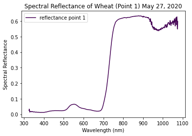
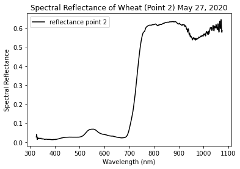

# README document for Assignment 3 

## File Usage:
*Assign3_SpecRefl.py* calculates the spectral reflectance of winter wheat vegetation from a CSV containing Analytical Spectral Device (ASD) data.

*TEST_for_Assign3_SpecRefl.py* is a file used for testing of Assign3_SpecRefl.py program.

*Wheat_20200527.csv* is a CSV file containing ASD data from May 27, 2020. Is used as the input file for Assign3_SpecRefl.py program.

*plot1_example.png* is an image file showing an example of how the output plot for sample point 1 should appear.

*plot2_example.png* is an image file showing an example of how the output plot for sample point 2 should appear.

## Data Source:
Data was collected on May 27, 2020 in a field West of London, ON. Field work was performed in correspondence with UWO and A&L Laboratories.

Figure 1: Collection of spectral reflectance using an ASD (FieldSpecPro) in a Corn field South of London, ON (2020).
